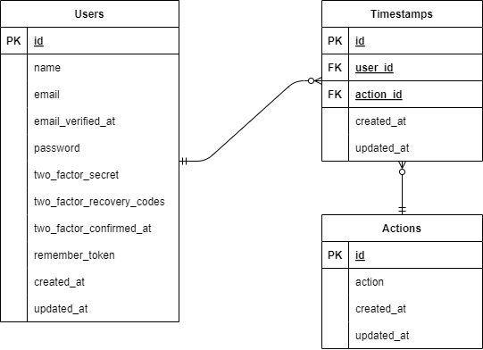

# 勤怠管理アプリ
## 概要
ユーザーごとの1日の勤務時間と休憩時間を記録する為のアプリです。
日付ごと、ユーザーごとの勤怠一覧も確認できます。

## 使用技術
- Docker
- Laravel:8.83.8
- Fortify
- MailHog
- nginx:1.21.1
- php:7.4.9
- MySQL:8.0.26
- phpMyAdmin

## ER図

## URL
- 開発環境：http://127.0.0.1/
- 本番環境：http://
- phpMyAdmin：http://〇.〇.〇.〇:8080/
- MailHog：http://〇.〇.〇.〇:8025/
※「〇.〇.〇.〇」には各環境のIPアドレスを入れてください。

## 開発環境構築
### Dockerビルド
1. `git clone git@github.com:mdotplus/beginner-project.git`
1. `docker compose up -d --build`
### Laravel環境構築
1. `docker compose exec php bash`
1. `composer install`
1. .env.exampleファイルを複製して.envファイルを作成し、データベースに関する環境変数を変更
1. `php artisan key:generate`
1. `php artisan migrate`
1. `php artisan db:seed`
