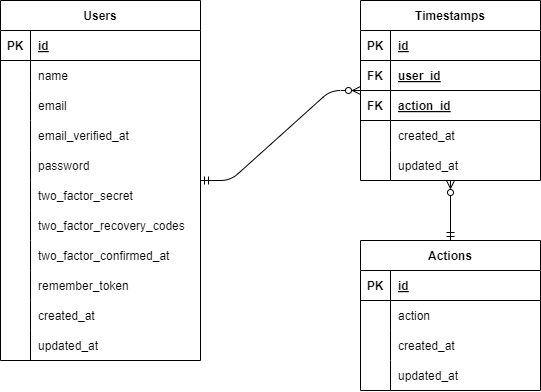

# 勤怠管理アプリ

## 概要
ユーザーごとの1日の勤務時間と休憩時間を記録する為のアプリです。
日付ごと、ユーザーごとの勤怠一覧も確認できます。
最低限の機能のみを有しており、勤怠管理をアプリ管理する際の試験導入に適しています。

## 機能一覧
- 会員登録
- メール認証
- ログイン、ログアウト
- 出退勤記録、休憩記録
- 日付別勤怠一覧
- ユーザー別勤怠一覧

## 使用技術
- Docker
- Laravel:8.83.8
- Fortify:1.19.1
- MailHog
- nginx:1.21.1
- php:7.4.9
- MySQL:8.0.26
- phpMyAdmin

## ER図

## テーブル設計
### Users
|カラム名|型|PRIMARY KEY|UNIQUE KEY|NOT NULL|FOREIGN KEY|説明|
|----|----|:--:|:--:|:--:|:--:|----|
|id|unsigned bigint|○||○||主キー|
|name|varchar(255)|||○||ユーザー名|
|email|varchar(255)||○|○||メールアドレス|
|email_verified_at|timestamp|||||メール認証実行の有無|
|password|varchar(255)|||○||パスワード|
|two_factor_secret|text||||||
|two_factor_recovery_codes|text||||||
|two_factor_confirmed_at|timestamp||||||
|remember_token|varchar(100)||||||
|created_at|timestamp|||||ユーザー登録日時|
|updated_at|timestamp|||||ユーザー情報更新日時|
### Timestamps
|カラム名|型|PRIMARY KEY|UNIQUE KEY|NOT NULL|FOREIGN KEY|説明|
|----|----|:--:|:--:|:--:|:--:|----|
|id|unsigned bigint|○||○||主キー|
|user_id|unsigned bigint|||○|○|外部キー|
|action_id|unsigned bigint|||○|○|外部キー|
|created_at|timestamp|||||タイムスタンプ作成日時|
|updated_at|timestamp|||||タイムスタンプ更新日時|
### Actions
|カラム名|型|PRIMARY KEY|UNIQUE KEY|NOT NULL|FOREIGN KEY|説明|
|----|----|:--:|:--:|:--:|:--:|----|
|id|unsigned bigint|○||○||主キー|
|action|varchar(255)|||○||アクションの種類|
|created_at|timestamp|||||アクション作成日時|
|updated_at|timestamp|||||アクション更新日時|

## URL
- 開発環境：http://127.0.0.1/
- 本番環境：http://
- phpMyAdmin：http://〇.〇.〇.〇:8080/
- MailHog：http://〇.〇.〇.〇:8025/
※「〇.〇.〇.〇」には各環境のIPアドレスを入れてください。

## 開発環境構築
### Dockerビルド
1. `git clone git@github.com:mdotplus/beginner-project.git`
1. `docker compose up -d --build`
### Laravel環境構築
1. `docker compose exec php bash`
1. `composer install`
1. .env.exampleファイルを複製して.envファイルを作成し、データベースに関する環境変数を変更
1. `php artisan key:generate`
1. `php artisan migrate`
1. `php artisan db:seed`
